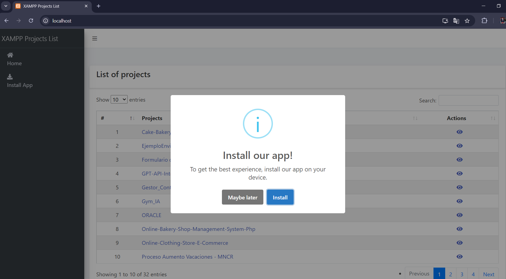
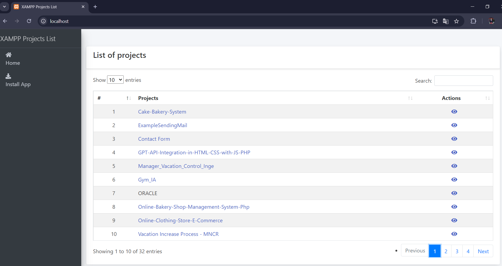
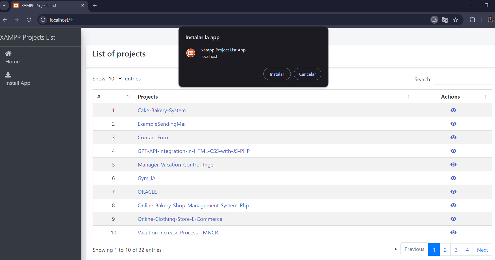
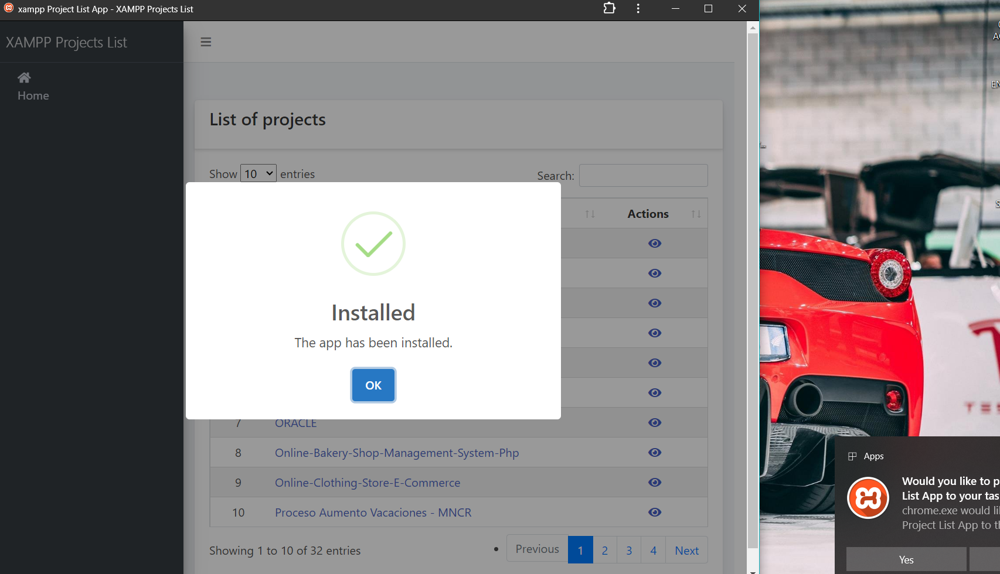
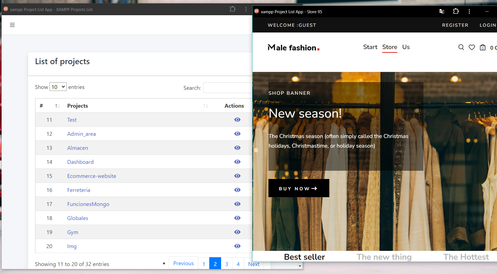

# XAMPP Web Project List

This project displays a list of PHP projects located within the htdocs directory of XAMPP. The application generates a simple interface that allows you to view available projects, open them, and perform actions like editing or deleting (to be implemented).
## Prerequisites
* XAMPP installed and running on your system.
*  PHP installed (typically included with XAMPP).
* The application assumes your projects are located in the htdocs folder of your XAMPP installation.

## Installation Steps
1. Locate XAMPP's htdocs directory: Navigate to your XAMPP installation folder, typically located at: 

        C:/xampp/htdocs

2. Replace the default index.php file: Inside the htdocs folder, replace the existing index.php (if it exists) with the index.php file from this project.

     * Original Path:

             C:/xampp/htdocs/index.php

* New File:

  Use the index.php provided in this project, located inside the xampp_project_list folder.

You should replace the file, and it will automatically serve as the new entry point for your local XAMPP projects.

3. Place xampp_project_list folder in htdocs: Copy the entire xampp_project_list folder, which contains all the necessary files for the project, into the htdocs directory.

       C:/xampp/htdocs/xampp_project_list

4. Start XAMPP: Ensure XAMPP is running, particularly the Apache and MySQL modules if you are using a MySQL-based project.

5. Access the Project List: Open your browser and navigate to:
        
        http://localhost/

You will see a list of all available PHP projects located in the htdocs folder, along with actions to view each project.

### Features:

* Project Listing: Automatically detects all directories inside htdocs that contain PHP projects.
* Project Actions:
  * View: Opens the selected project in a new tab.

### Customization:

If you want to exclude certain directories (such as system folders like .github or hidden directories), you can modify the index.php file and add them to the exclusion list in the $excludedDirs array.

    $excludedDirs = ['.', '..', '.github', 'other_excluded_directory'];

### Future Improvements
* Add functionality for editing and deleting projects. 
* Support for other file types or project structures.

## Screenshots:

### Image #01

### Image #02

### Image #03

### Image #04

### Image #05

## LICENSE:
This project is licensed under the MIT License.
